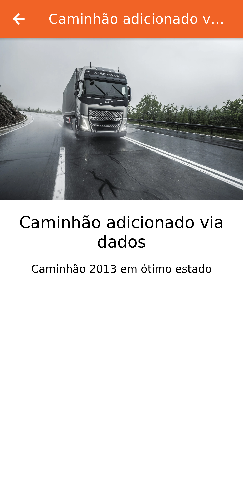
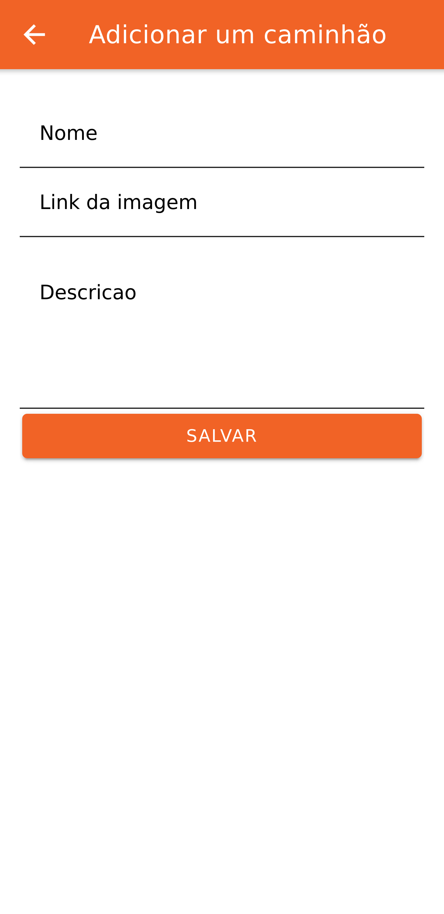

<h1 align="left">BLD LT (Logistica e treinamentos)</h1>

# Sobre o desenvolvimento
Este aplicativo foi desenvolvido com parceria com **Maximilian Schwarzmüller** da https://academind.com/ que obtivemos um tempo de desenvolvimento de aproximadamente 3h30m.

Seguindo o video https://www.youtube.com/watch?v=mQ4zmFy4d7Y

# Sobre as linguagens
Foi desenvolvido em Ionic e Vue.JS. Segundo o tutorial, foi decidido por não usar typescript para o desenvolvimento, optando por retirar ele do repositório e usando apenas javascript.

# Sobre as plataformas
Ionic é um framework para desenvolvimento hibrido, porem para esse projeto optei por desenvolver apenas para android, rodando o projeto em um emulador do Android Studio.

# Sobre as telas
O projeto é simples e tem apenas 3 telas. Às quais podemos ver uma lista de caminhões, os detalhes de cada um, e adicionar um novo, conforme as imagens abaixo

#### Tela de listagem
<kbd>
  
</kbd>

#### Tela de detalhamento
<kbd>
  
</kbd>

#### Tela para adicionar novo camiminhão
<kbd>
  
</kbd>

# Licença
Todos os direitos desse desenvolvimento são da BATEL TRANSPORTE LOGISTICA E DISTRIBUICAO LTDA e do desenvolvedor wellwlds
